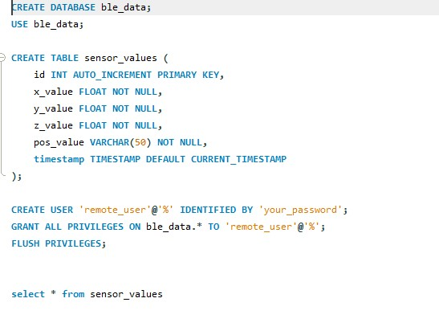
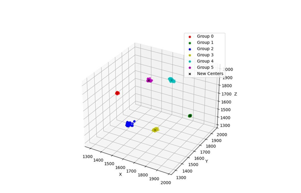
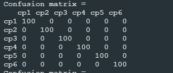

# Suuntaa ennustava neuroverkko

# Tuomas Tavi TVT23SPL ryhmä: 21

# Projekti 2024 syksy

Oulun Ammattikorkeakoulun viestinnän ja tietotekniikan insinööri koulutus toinen vuosi

## Projektin pääidea

Ideana on luoda yhteys NRF-laitteen, Raspberry Piillä juoksevan SSH-serverin ja virtuaalisella koneella juoksevan SQL-tietokannan välillä. Tätä pitkin lähetetään akselikiihtyvyysanturin arvoja ja käytetään niitä opettamaan neuroverkko ja implementoidaan se NRF-laitteelle.

Laitteet

- NRF5340dk
- Raspberry Pi 3
- Thinkpad x260
- SSH- serveri x2
- Virtual machine

Komponentit

- GY-81 akselikiihtyvyysanturi
- SD-kortti
- Bluetooth radio

Protokollat

- LE LL
- TCP socket

Haasteet ja huomioitavaa

Bluetooth LE on heikko yhtedeltään ja paketti kooltaan, joten paketti koko kannattaa pitää pienenä ja jos yhteys ei näytä toimivan muistaa liikkuttaa laitteita lähemmäksi. Varsinkin luokka huoneessa, jossa monilla on Bluetooth-laitteita juoksemassa singaali voi saada paljon häiriötä. NRF5340dk- alsutalle koodataan C-kielellä, mikä tekee työstä paljon haastavampaa joten oletan, että tämä viimeinen osio on luultavasti vaikein. K-means-mallissa keskipisteiden initialisaatio on tärkein osa, joten se kannattaa tehdä hyvin. Itse ratkaisin tämän sillä, että jos jokin keskipiste ei ”voita” pisteitä itselleen initialisoidaan kaikki pisteet uudelleen.

### NRF-5340dk aloitus

Projektissa ideana on aluksi mitata GY-81-akselikiihtyvyysanturilla x- , y- ja z akselin kiihtyvyysarvoja. Kun tämä osio on saatu toimimaan, näitä arvoja seuraavaksi lähetetään Bluetoothin yli omalle kännykälle, joka vastaan ottaa niitä NRF-Connect- sovelluksella. Tämä yhteys toimii tilaamalla ominaisuus/ominaisuudet, joista arvoja lähetetään. Samalla pitäisi lähettää positio eli numero 0–5, jota kontrolloidaan napin painalluksella.

### Raspberry Pi

Kun nämä toiminnallisuudet ovat todistetusti toiminnassa, seuraavana täytyy saada arvot lähetettyä Raspberry-pi alustalle. Raspberry Pillä on aktiivinen Linux SSH-serveri, johon voi yhdistää olettaen, että olet samassa verkossa. Raspberry-pi:llä olevalle serverille tarkoituksena on tehdä Python-skripti, joka ottaa vastaan tilaus tyypillä akselinkiihtyvyys arvoja ja vie niitä joko omalle tai valmiille SQL-tietokannalle.

### VM linux ssh-serveri

Linux-serverillä on ideana laittaa pyörimää Apache-palvelin, jossa pyörii SQL-database. Tälläinen löytyy valmiiksi tehtynä myös, mutta omassa tapauksessa päätin tehdä omalle serverilleni toteutuksen. Raspberry Piillä tietysti täytyy kirjautua tähän SQL-palvelimeen, joten kuvassa 1 on tekemäni käyttäjä.

_KUVA 1. Demo-versio, joka on tehty MySQL-Workbenchissä_

Kun data oli saatu tietokantaan se piti saada sieltä omalle koneelle käyttäen python-skriptiä. Vaihtoehtona oli monenlaisia tapoja, mutta itse päädyin tcp-socket http:n yli vetävään skriptiin. Tämä tarkoitti kuitenkin, että jouduin luomaan http-päätepisteen joka hakisi sensor_values- taulukon tiedot. Jostain syystä tämä toimi vain 8080 portilla, vaikka en ollut kieltänyt 5000 porttia jota kokeilin ensin.

Oma kannettava

Python-skriptiä käyttäen sain kirjoitettua tietokannan datan CSV-tiedostoon ja tällä datalla voidaan jatkaa seuraavan osaan eli neuroverkon opettamiseen ja sen implementointiin NRF5340dk-laitteelle. Ensimmäisenä täytyi tehdä K-means-algoritmi, joka pystyy optimoimaan mahdollisimman hyvät keskipisteet ryppäille eli clustereille. Esimerkki lopputuloksesta näkyy kuvassa 2. Kun optimaaliset keskipisteet eli centroidit, on löydetty ne tallennetaan Header-tiedostoon.

_KUVA 2. Esimerkki lopullisista keskipisteitä 3D-koordinaatistossa_

Tämän jälkeen lisätehtävä oli opettaa mahdollisimman yksinkertainen Keras-malli mitatulla datalla ja implementoida se uudelleen siten, että se on mahdollisimman lähellä C-kieltä eli ilman, että käyttää Pythonin valmiita funktioita, jotka tekee laskut puolestasi. Tästä mallista myös otetaan painot ja biakset talteen Header-tiedostoon, jotta niitä voidaan hyödyntää viimeisessä vaiheessa.

## NRF5340dk lopetus

Viimeisessä vaihessa K-means-algoritmi toteutetaan käyttäyen Header-tiedostossa olevia optimaalisia keskipisteitä ja mitataan confusion matriksilla sen mallin toimivuus.

Lisätehtävänä on tehdä sama myös Keras-mallille. Kuvassa 3 näkyy lopullinen confusion matrix, joka oli sama molemmissa malleissa.

_KUVA 3. Lopullinen confusion matrix._
