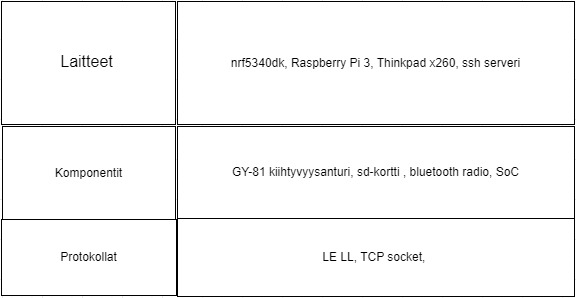

# Projekti2024Syksy

Ideana projektissa on mitata akselinkiihtyysanturilla x , y ja z akselin arvoja, jotka viedään Raspberry Pi:lle josta taas tieto viedään ssh serverille jossa tiedot tallentuu datapankkiin.Tämän jälkeen tehdään python tcp socket koodi jolla saadaan tiedot omalle koneelle joita käytetään neuroverkon opettamiseen. Tämän mallin mukaisesti implementoidaa neuroverkko suoraan nrf5340 laitteelle c-kielellä.

